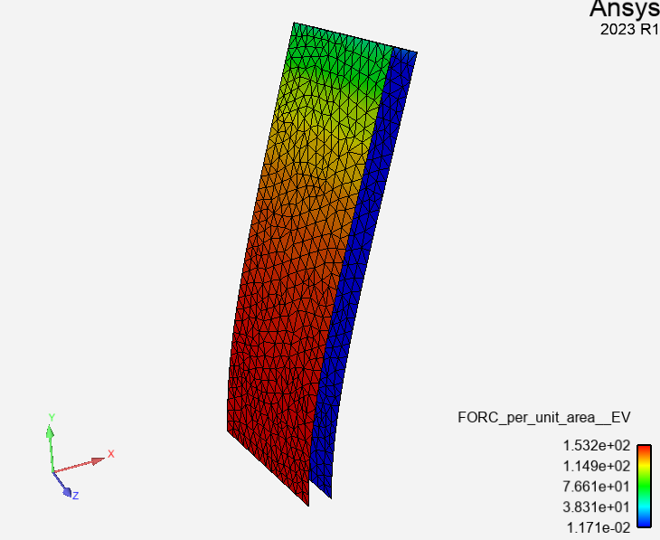
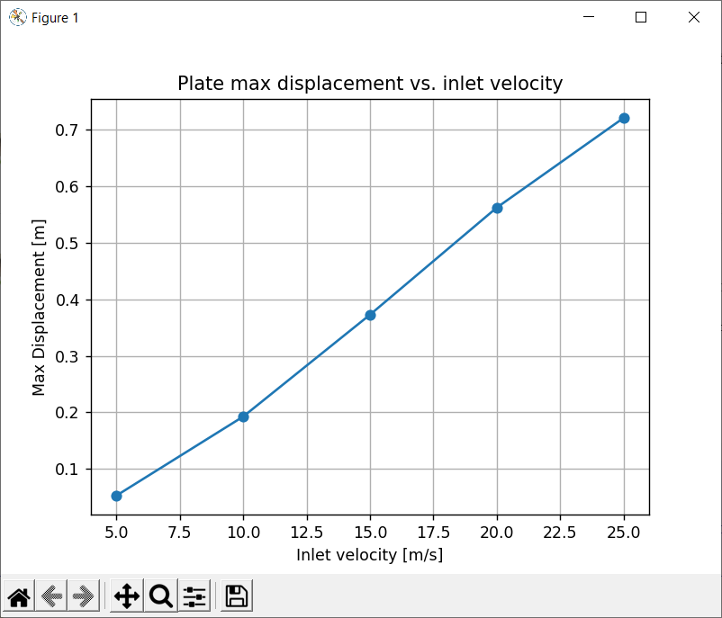

# "Parametric sweep" case

This is a steady FSI case, where the fluid is flowing over a flexible plate.

The goal is to plot some data of maximum plate deflection as the function of the fluid inlet velocity.

It demonstrates the usage of pyAnsys tools, in particular pySystemCoupling.

## Pre-requisites

Latest 2023 R1 unified install.

## Python environment setup

Start a console in this working directory.

### Create Python virtual environment

This avoids polluting the actual Python installation with various packages.

`"%AWP_ROOT231%\commonfiles\CPython\3_7\winx64\Release\python\python.exe" -m venv venv`

This should create a "venv" sub-directory.

### Activate the Python virtual environment

`venv\Scripts\activate.bat`

### Install required pyAnsys packages

`pip install matplotlib`

Install pySystemCoupling
`pip install ansys_systemcoupling_core-0.1.dev0-py3-none-any.whl`

Install pyDpf package. Note that we need to use the latest version
of pyDpf package to make it work with 23.1.
`pip install --pre ansys-dpf-core==0.6.dev0 --extra-index-url http://canartifactory.ansys.com:8080/artifactory/api/pypi/pypi/simple --trusted-host canartifactory.ansys.com`

Install pyFluent
`pip install ansys-fluent-core`

### (For developers - unset SYSC_ROOT environment variable if it is set)
`set SYSC_ROOT=`

### Force Fluent to use 23.1 version (well at least I needed to do this)
`set AWP_ROOT222=%AWP_ROOT231%`

#### Go over the run.py script

##### Part 1

Sets various inlet velocity values on the x-axis,
solves the FSI cases with these values and uses
DPF-Post to extract the maximum displacement value from
the MAPDL results.

Then, uses matplotlib package to create a 2D plot of maximum displacement vs. inlet velocity.

#### Start Python and run the run.py script

`python run.py`

This script may take a while to run but in the end it should bring up
a plot looking like this:

  
